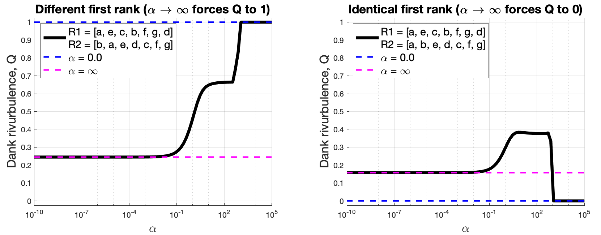

# The rank-turbulence divergence

An attempt at implementing a python version of the rank-turbulence divergence,
introduced in the recent paper:

- Dodds, P.S.,  Minot, J. R., Arnold, M. V., Alshaabi, T., Adams, J. L.,
Dewhurst, D. R., Gray, T. J., Frank, M. R., Reagan, A. J., Danforth C. M.
(2020). *Allotaxonometry and rank-turbulence divergence: A universal instrument
for comparing complex systems.* 
[arXiv 2002.09770](https://arxiv.org/abs/2002.09770).

- - - -

Below is the definition of the rank-turbulence divergence. For the most detailed version of this definition, including motivation and discussion of its various features, see Section II.D (no relation) of the paper. 

![\begin{align} D_{\alpha}^{R}(R_1||R_2) &= \displaystyle \sum_{\tau \in R_{1,2;\alpha}} \delta D_{\alpha,\tau}^{R}(R_1||R_2)\nonumber\\ &= \dfrac{1}{\mathcal{N}_{1,2;\alpha}} \dfrac{\alpha+1}{\alpha} \displaystyle\sum_{\tau \in R_{1,2;\alpha}} \Big\vert \dfrac{1}{\big\[r_{\tau,1}\big\]^\alpha} - \dfrac{1}{\big\[r_{\tau,2}\big\]^\alpha} \Big\vert^{1/(\alpha+1)}\nonumber \end{align}](https://render.githubusercontent.com/render/math?math=%5Cbegin%7Balign%7D%20D_%7B%5Calpha%7D%5E%7BR%7D(R_1%7C%7CR_2)%20%26%3D%20%5Cdisplaystyle%20%5Csum_%7B%5Ctau%20%5Cin%20R_%7B1%2C2%3B%5Calpha%7D%7D%20%5Cdelta%20D_%7B%5Calpha%2C%5Ctau%7D%5E%7BR%7D(R_1%7C%7CR_2)%5Cnonumber%5C%5C%20%26%3D%20%5Cdfrac%7B1%7D%7B%5Cmathcal%7BN%7D_%7B1%2C2%3B%5Calpha%7D%7D%20%5Cdfrac%7B%5Calpha%2B1%7D%7B%5Calpha%7D%20%5Cdisplaystyle%5Csum_%7B%5Ctau%20%5Cin%20R_%7B1%2C2%3B%5Calpha%7D%7D%20%5CBig%5Cvert%20%5Cdfrac%7B1%7D%7B%5Cbig%5Br_%7B%5Ctau%2C1%7D%5Cbig%5D%5E%5Calpha%7D%20-%20%5Cdfrac%7B1%7D%7B%5Cbig%5Br_%7B%5Ctau%2C2%7D%5Cbig%5D%5E%5Calpha%7D%20%5CBig%5Cvert%5E%7B1%2F(%5Calpha%2B1)%7D%5Cnonumber%20%5Cend%7Balign%7D)

where *r* refers to the (float) ranking of element &tau; (for example, a team in the premier league and its rank), such that *r=1.0* is the first place team. The *N<sub>1, 2; &alpha;</sub>* term refers to a normalization factor that forces the rank-turbulence divergence to be between 0 and 1 and is expressed as follows:

![\begin{align} \mathcal{N}_{1,2;\alpha} &= \dfrac{\alpha+1}{\alpha} \displaystyle\sum_{\tau \in R_1} \big\vert \dfrac{1}{\big\[r_{\tau,1}\big\]^\alpha} - \dfrac{1}{\big\[N_1 + \frac{1}{2}N_2\big\]^\alpha} \Big\vert^{1/(\alpha+1)} \nonumber\\&+ \dfrac{\alpha+1}{\alpha} \displaystyle\sum_{\tau \in R_1} \big\vert \dfrac{1}{\big\[N_2 + \frac{1}{2}N_1\big\]^\alpha} - \dfrac{1}{\big\[r_{\tau,2}\big\]^\alpha} \big\vert^{1/(\alpha+1)}\nonumber \end{align}](https://render.githubusercontent.com/render/math?math=%5Cbegin%7Balign%7D%20%5Cmathcal%7BN%7D_%7B1%2C2%3B%5Calpha%7D%20%26%3D%20%5Cdfrac%7B%5Calpha%2B1%7D%7B%5Calpha%7D%20%5Cdisplaystyle%5Csum_%7B%5Ctau%20%5Cin%20R_1%7D%20%5Cbig%5Cvert%20%5Cdfrac%7B1%7D%7B%5Cbig%5Br_%7B%5Ctau%2C1%7D%5Cbig%5D%5E%5Calpha%7D%20-%20%5Cdfrac%7B1%7D%7B%5Cbig%5BN_1%20%2B%20%5Cfrac%7B1%7D%7B2%7DN_2%5Cbig%5D%5E%5Calpha%7D%20%5CBig%5Cvert%5E%7B1%2F(%5Calpha%2B1)%7D%20%5Cnonumber%5C%5C%26%2B%20%5Cdfrac%7B%5Calpha%2B1%7D%7B%5Calpha%7D%20%5Cdisplaystyle%5Csum_%7B%5Ctau%20%5Cin%20R_1%7D%20%5Cbig%5Cvert%20%5Cdfrac%7B1%7D%7B%5Cbig%5BN_2%20%2B%20%5Cfrac%7B1%7D%7B2%7DN_1%5Cbig%5D%5E%5Calpha%7D%20-%20%5Cdfrac%7B1%7D%7B%5Cbig%5Br_%7B%5Ctau%2C2%7D%5Cbig%5D%5E%5Calpha%7D%20%5Cbig%5Cvert%5E%7B1%2F(%5Calpha%2B1)%7D%5Cnonumber%20%5Cend%7Balign%7D)

(equations rendered with HTML output from https://alexanderrodin.com/github-latex-markdown/)

- - - -


# Installation and Usage

In order to use this code, first clone/download the repository. 
Below is a simple example usage. Please feel free to reach 
out if you find any bugs, have any questions, or if for some reason
the code does not run. 

## Requirements  <a name="requirements"/>

This code is written in [Python 3.x](https://www.python.org) and uses 
the following packages / tools:

* [Scipy](http://www.scipy.org/)
* [Numpy](http://numpy.scipy.org/)
* [Itertools](https://docs.python.org/2/library/itertools.html)
* [Collections](https://docs.python.org/2/library/collections.html)

## Playground Notebooks
1. [rank_turbulence_divergence](https://nbviewer.jupyter.org/github/jkbren/rank-turbulence-divergence/blob/master/code/rank_turbulence_divergence.ipynb), which uses the `rtd.py` script, where the actual implementation is. Note also that this is... where the bugs are going to be. If you find them, please yell at me.

- - - -

<p align="center">

</p>

**<p align="center">Fig. 1: *Rank-turbulence divergence* betweeen two simple vectors.</center>**

<p align="center">

</p>

**<p align="center">Fig. 2: Matlab version: *Rank-turbulence divergence*.</center>**

Note: Fig. 2 is a validation using [this Matlab code from the authors](https://gitlab.com/compstorylab/allotaxonometer/-/tree/master).
- - - -

## Basic usage
```
>>> from rtd import rank_turbulence_divergence
>>> inputA_1 = ['a', 'e', 'c', 'b', 'f', 'g', 'd']
>>> inputA_2 = ['b', 'a', 'e', 'd', 'c', 'f', 'g']
>>> print("rtd =",rank_turbulence_divergence(inputA_1, inputA_2, alpha=1.0))
rtd = 0.45924793111057804
```

However, there are other data-types that can be input into the `rank_turbulence_divergence` function:
```
>>> from rtd import rank_turbulence_divergence
>>> from numpy.random import shuffle
>>> inputB_1 = ['a']*20 + ['e']*14 + ['c']*8 + ['b']*7 + ['f']*4 + ['g']*2 + ['d']*1
>>> inputB_2 = ['b']*24 + ['a']*16 + ['e']*5 + ['d']*4 + ['c']*3 + ['f']*2 + ['g']*1
>>> shuffle(inputB_1)
>>> shuffle(inputB_2)

>>> print('inputB_1:',inputB_1)
inputB_1: ['a', 'a', 'a', 'c', 'g', 'f', 'c', 'a', 'a', 'c', 'e', 'e', 'a', 'e', 'e', 'a', 'b', 'a', 'a', 'a', 'a', 'a', 'g', 'c', 'e', 'b', 'c', 'a', 'e', 'b', 'e', 'e', 'e', 'b', 'e', 'f', 'c', 'f', 'e', 'b', 'b', 'a', 'a', 'a', 'c', 'f', 'a', 'a', 'a', 'a', 'c', 'e', 'd', 'e', 'e', 'b']

>>> print('inputB_2:',inputB_2)
inputB_1: ['a', 'a', 'a', 'c', 'g', 'f', 'c', 'a', 'a', 'c', 'e', 'e', 'a', 'e', 'e', 'a', 'b', 'a', 'a', 'a', 'a', 'a', 'g', 'c', 'e', 'b', 'c', 'a', 'e', 'b', 'e', 'e', 'e', 'b', 'e', 'f', 'c', 'f', 'e', 'b', 'b', 'a', 'a', 'a', 'c', 'f', 'a', 'a', 'a', 'a', 'c', 'e', 'd', 'e', 'e', 'b']

>>> print("rtd =",rank_turbulence_divergence(inputB_1, inputB_2, alpha=1.0))
rtd = 0.45924793111057804
```

As well as dictionaries of counts:

```
>>> from rtd import rank_turbulence_divergence
>>> from collections import Counter
>>> inputC_1 = dict(Counter(inputB_1))
>>> inputC_2 = dict(Counter(inputB_2))
>>> print("rtd =",rank_turbulence_divergence(inputC_1, inputC_2, alpha=1.0))
rtd = 0.45924793111057804
```

- - - -

## Citation   <a name="citation"/>

Play around with this measure, it rocks! If you use it in your work, be sure to cite these folks:

Dodds, P.S.,  Minot, J. R., Arnold, M. V., Alshaabi, T., Adams, J. L.,
Dewhurst, D. R., Gray, T. J., Frank, M. R., Reagan, A. J., Danforth C. M.
(2020). **Allotaxonometry and rank-turbulence divergence: A universal instrument
for comparing complex systems.**
[arXiv 2002.09770](https://arxiv.org/abs/2002.09770).

Bibtex: 
```text
@article{dodds2020rtd,
  title = {Allotaxonometry and rank-turbulence divergence: A universal instrument for comparing complex systems},
  author = {Dodds, P.S. and Minot, J. R. and Arnold, M. V. and Alshaabi, T. and Adams, J. L. and Dewhurst, D. R. and Gray, T. J. and Frank, M. R. and Reagan, A. J. and Danforth C. M.},
  journal = {arXiv},
  year = {2020},
  url = {https://arxiv.org/abs/2002.09770}
}
```

- - - -

#### This repo uses ideas and insights about network comparison. If that interests you, also check out:

* Hartle, H., Klein, B., McCabe, S. St-Onge, G., Murphy, C., Daniels, A.,
& Hébert-Dufresne, L. (under review).
*Network comparision and the within-ensemble graph distance*.
    + forthcoming work defining the *within-ensemble graph distance*
* McCabe, S., Torres, L., LaRock, T., Haque, S., Yang, C-H., Hartle, H.,
& Klein, B. (in prep.). [**netrd**](https://github.com/netsiphd/netrd): A
library for network reconstruction and graph distances}.
    + the `netrd` python package that, among other things, has dozens
    of *graph distance* tools implemented.
