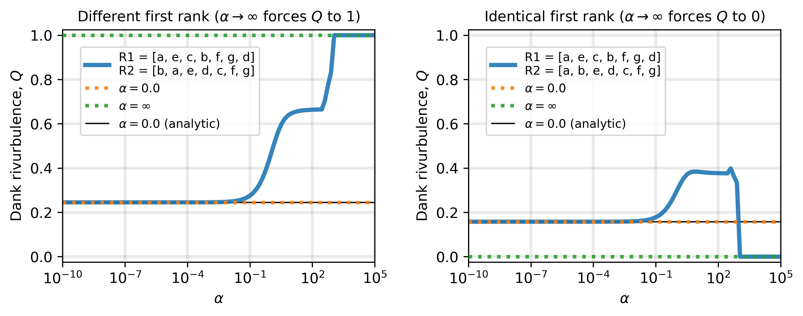

# The rank-turbulence divergence

An attempt at implementing a python version of What  follows is a python
playground looking at the recent paper:

- Dodds, P.S.,  Minot, J. R., Arnold, M. V., Alshaabi, T., Adams, J. L.,
Dewhurst, D. R., Gray, T. J., Frank, M. R., Reagan, A. J., Danforth C. M.
(2020). *Allotaxonometry and rank-turbulence divergence: A universal instrument
for comparing complex systems.* 
[arXiv 2002.09770](https://arxiv.org/abs/2002.09770).


## Playground Notebooks
1. [rank_turbulence_divergence](https://nbviewer.jupyter.org/github/jkbren/rank-turbulence-divergence/blob/master/code/rank_turbulence_divergence.ipynb), which uses the `rtd.py` script, where the actual implementation is.


## Installation and Usage

In order to use this code, first clone/download the repository. 
Below is a simple example usage. Please feel free to reach 
out if you find any bugs, have any questions, or if for some reason
the code does not run. 

## Requirements  <a name="requirements"/>

This code is written in [Python 3.x](https://www.python.org) and uses 
the following packages / tools:

* [Scipy](http://www.scipy.org/)
* [Numpy](http://numpy.scipy.org/)
* [Itertools](https://docs.python.org/2/library/itertools.html)
* [Collections](https://docs.python.org/2/library/collections.html)

- - - -

<p align="center">

</p>

**<p align="center">Fig. 1: *Rank-turbulence divergence* betweeen two simple vectors.</center>**

- - - -

## Citation   <a name="citation"/>

If you use these methods and this code in your own research, please cite this:

Dodds, P.S.,  Minot, J. R., Arnold, M. V., Alshaabi, T., Adams, J. L.,
Dewhurst, D. R., Gray, T. J., Frank, M. R., Reagan, A. J., Danforth C. M.
(2020). **Allotaxonometry and rank-turbulence divergence: A universal instrument
for comparing complex systems.**
[arXiv 2002.09770](https://arxiv.org/abs/2002.09770).

Bibtex: 
```text
@article{dodds2020rtd,
  title = {Allotaxonometry and rank-turbulence divergence: A universal
           instrument for comparing complex systems},
  author = {Dodds, P.S. and Minot, J. R. and Arnold, M. V. and Alshaabi, T.
            and Adams, J. L. and Dewhurst, D. R. and Gray, T. J. and
            Frank, M. R. and Reagan, A. J. and Danforth C. M.},
  journal = {arXiv},
  year = {2020},
  url = {https://arxiv.org/abs/2002.09770}
}
```

## This repo uses ideas and insights about network comparison. See also:

* Hartle, H., Klein, B., McCabe, S. St-Onge, G., Murphy, C., Daniels, A.,
& Hébert-Dufresne, L. (under review).
*Network comparision and the within-ensemble graph distance*.
    + forthcoming work defining the *within-ensemble graph distance*
* McCabe, S., Torres, L., LaRock, T., Haque, S., Yang, C-H., Hartle, H.,
& Klein, B. (in prep.). [**netrd**](https://github.com/netsiphd/netrd): A
library for network reconstruction and graph distances}.
    + the `netrd` python package that, among other things, has dozens
    of *graph distance* tools implemented.
